## What does it take to be European? {.title-light background-color="#fbfaf7"}

```{=html}
<div style="display:flex; align-items:flex-start; gap:40px;">
  <div style="flex:1;">
    <p class="title-sub">Conceptions of Europeanness and their political consequences among German citizens</p>
    <p style="color:#2f6f9f; margin-top:1.4em;">
      Isabela Zeberio &middot; Theresa Kuhn<br>
      <span style="font-size:.85em;">University of Amsterdam</span><br>
      <span style="font-size:.85em;">19/06/2026</span>
    </p>
  </div>
  <div style="flex:0 0 460px; display:flex; align-items:center; justify-content:center; padding-top:10px;">
    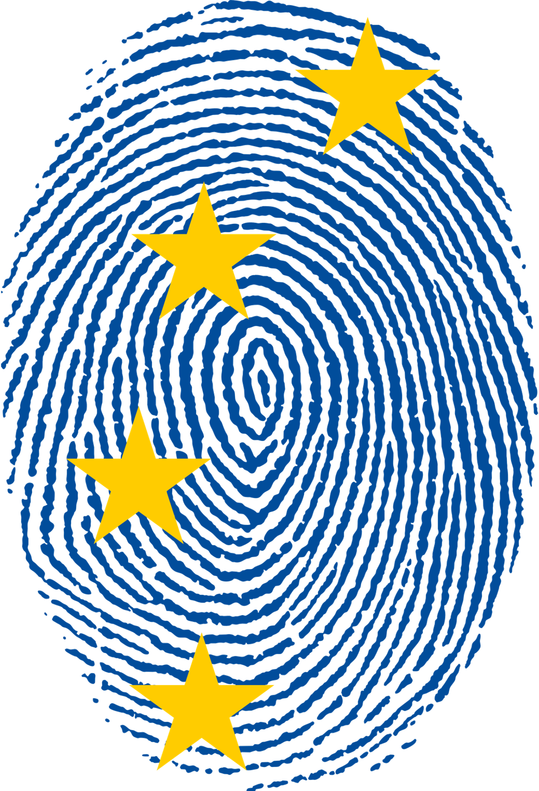
  </div>
</div>
```
::: notes
Today I want to convince you that you cannot read what European identity *means* from how people describe belonging --- you have to look at how they draw the line on the other side.
:::

## Two answers to the same "we" {background-color="#fbfaf7"}

::: {.fragment .bigq .civic style="font-size:0.95em;"}
"Fighting for freedom connects us as Europeans. Our past and our present. Our nations and our generations. For me, this is the raison d'être of our Union and it remains its driving force more than ever today... And above all it will mean staying united and true to our values." [Commission President von der Leyen [@vonderleyen2024]]{.src}
:::

::: {.fragment .bigq .excl style="font-size:0.95em;"}
"We, as Europeans, are more than the sum of our national identities. Our history, our heritage, our Judeo-Christian roots and our cultural diversity define us." [European People's Party manifesto [@epp2024]]{.src}
:::

::: notes
Two leading actors, same "we as Europeans", two different foundations.
Self-identification doesn't tell you which one a person holds.
:::

## Who are *the Europeans*? {background-color="#fbfaf7"}

```{=html}
<div style="display:grid; grid-template-columns:1fr 1fr; gap:24px; margin:8px 0 6px 0;">
  <div style="display:flex; flex-direction:column; align-items:center; justify-content:center;">
    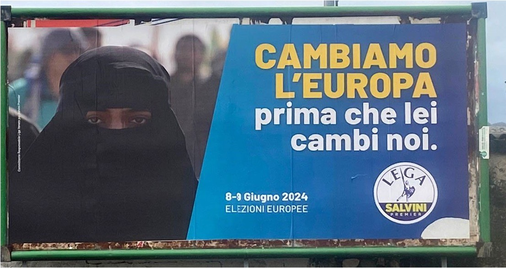
  </div>
  <div style="display:flex; flex-direction:column; align-items:center; justify-content:center;">
    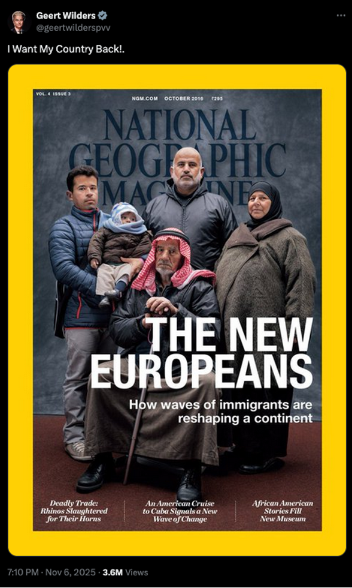
  </div>
</div>
```
::: notes
These parties and figures are now central, not fringe.
They claim to defend "Europe" --- but a particular Europe.
The question of who belongs is live and politically charged.
:::

## European identity as a collective identity {background-color="#fbfaf7"}

::: fragment
Citizens' self-categorisation as European, together with their evaluation of their membership and their affective attachment to Europe and other Europeans [@bergbauer2018]

-   **Cognitive** --- awareness of being part of the group
-   **Affective** --- emotional attachments and feelings of love and concern for the group
-   **Evaluative** --- knowledge about the social group; encompasses symbolic boundaries
:::

::: notes
This paper focuses on the second component.
We know a good deal about who self-identifies as European --- people with higher socio-economic status, transnational experiences, left-wing ideology, and those who are more politically engaged and trusting (for a recent meta-analysis see @Fernandez2026EuropeanIdentity).
We know much less about the evaluative content, i.e. what it means and takes to be European [@konig_forms_2024; @abdelal_identity_2008], and where people draw the line between the European in-group and a common out-group.
:::

## What we measure --- and what we miss {background-color="#fbfaf7"}

::: {.fragment .accent}
→ abstract, decontextualized, and only the in-group.
:::

::: fragment
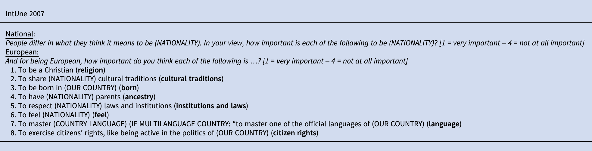{fig-alt="IntUne 2007 closed-battery item" width="95%"}
:::

::: notes
Social identity has cognitive, emotional, and evaluative components.
The field has done the first two well.
The third --- the criteria people use to decide who belongs --- is underexplored at the European level.
:::

## Two assumptions worth questioning {background-color="#fbfaf7"}

::: fragment
**1. The civic--ethnic dichotomy sorts people into types.** <br>
:::

::: {.fragment style="font-size: 0.9em;"}
But individuals *mix* [@lindstam_conceptions_2021].<br> Ideal types, not citizen reality [@piwoni_ced_2023].
:::

::: fragment
**2. Civic = Inclusive & Ethnic = Exclusive.** <br>
:::

::: {.fragment style="font-size: 0.9em;"}
Yet civic language can do exclusionary work.<br> *Selective liberalism*: liberal values invoked to reject what is associated with Islam [@SimonsenKristina2020; @lopezortega_selectively_2025].
:::

::: fragment
Does the same hold for *Europeanness* --- a thinner, more permeable identity that was create to *Unite in diversity*?
:::

::: notes
European identity was theorized to be MORE open than national identity --- "unity in diversity".
So if even here civic language hides exclusion, that's striking.
:::

## Research questions {background-color="#fbfaf7"}

::: fragment
**RQ1 --- Shape of the boundary.** What criteria do Germans use to include and to exclude --- and are the two sides built from the *same* logic or *different* ones?
:::

::: fragment
**RQ2 --- Political consequences.** Do distinct conceptions of Europeanness carry distinct politics --- for attitudes and for vote?
:::

::: {.fragment .muted style="font-size: 0.75em;"}
**Expectations**:

-   Conceptions of Europeanness should predict **political attitudes** --- the *meaning* of an identity, not its existence, that determines its political consequence [@huddy_social_2001]
-   Predictions should be stronger on **cultural issues** than economic ones
-   More **exclusionary** conceptions → more **restrictive** attitudes
-   More **exclusionary** conceptions → greater likelihood of **radical-right vote**
:::

::: notes
RQ2 follows Huddy --- it's the *meaning* of an identity, not its mere existence, that drives politics.
:::

## Research design {background-color="#fbfaf7"}

::: fragment
**GESIS Panel.pop** --- probability-based German sample [@bosnjak_gesis_2017] Wave *lc* (Aug--Oct 2024), **N = 3,047**

Two **open-ended** questions, in respondents' own words:

-   *What does it take to be European?*
-   *What excludes someone from being European?*
:::

::: notes
**Why exclusion matters.** A boundary can look *open* from the inside.
Asking who does *not* belong forces the concrete edge to surface --- revealing whether the line is **bright** (uncrossable) or **blurred** [@alba_bright_2005; @clycq_2021].
:::

::: fragment
Hybrid inductive--deductive thematic coding: 20 codes → 8 themes: Origin, values, culture, procedural, (socio)economic, residence, religion, meaningless
:::

::: notes
Why manual: dictionaries flagged "skin colour" even when respondents DENIED it mattered.
Topic models forced one topic per answer.
LCA because people reason in bundles.
**Latent Class Analysis** --- recovers how criteria *combine within a person* TEU: \`The Union is founded on the values of respect for human dignity, freedom, democracy, equality, the rule of law and respect for human rights, including the rights of persons belonging to minorities.
These values are common to the Member States in a society in which pluralism, non-discrimination, tolerance, justice, solidarity and equality between women and men prevail''
:::

## First look: Europeanness sounds *open* {background-color="#fbfaf7"}

The five most-mentioned categories --- on **both** sides:

::: civic
Values · Democratic attachment · Traits & behaviour · Rights & obligations · European feeling
:::

::: {.fragment .bigq}
"Anyone who has moved here can also become European, as long as they feel attached to our values."
:::

::: notes
Read one side at a time, this is a cosmopolitan identity [@schlenker_cosmopolitan_2013].
But counting *which* ideas people reach for doesn't tell us *how* they use them.
:::

::: notes
This is the bait.
Let the audience believe the cosmopolitan story --- then pull it apart.
:::

## The two sides are *not* mirror images {background-color="#fbfaf7"}

Same respondent, both questions:

::: {.fragment .bigq .civic style="font-size:0.95em;"}
<p class="bigq civic">

Belongs: ".When I think of Europe, I think of Paris, the Côte d'Azur, England, London, my sister in Spain. No border controls. The very dear Nordic countries. No specific characteristic comes to mind. Hospitality and tolerance."

</p>
:::

::: {.fragment .bigq .excl style="font-size:0.95em;"}
<p class="bigq excl">

Does *not* belong: "The only characteristic that comes to mind is the intolerant Muslim men --- I would see them as non-European; men who do not see women as equal human beings."

</p>
:::

::: fragment
Jaccard overlap: 23% used identical criteria for both questions, 28% none in common, 49% partial.
:::

::: notes
The single respondent does the work of a thousand.
Cosmopolitan inside, bright religious edge outside.
14 of 20 codes asymmetric, almost all leaning to inclusion --- religion the great exception.
:::

::: notes
Why an inclusion-only battery misses things: knowing whom someone admits doesn't tell you whom they exclude.
:::

## LCA --- Inclusion {background-color="#fbfaf7"}

::: {style="text-align:center;"}
<div>

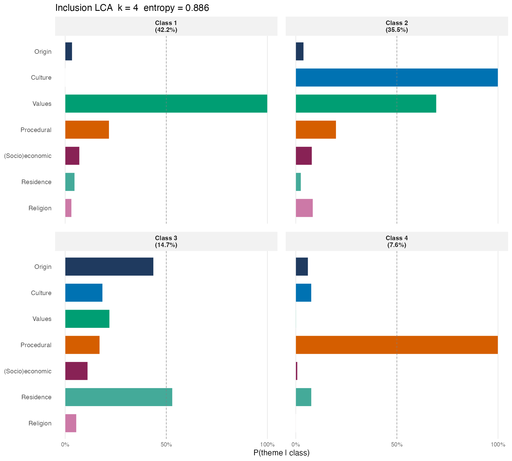{fig-alt="Inclusion LCA classes" width="55%"}

</div>

::: notes
The civic surface is already *not uniform*: values alone vs. values *conditional* on culture.
:::
:::

::: notes
Entropy 0.886.
Note: there is NO religion class here --- flag that for the next slide.
:::

## LCA --- Exclusion {background-color="#fbfaf7"}

::: {style="text-align:center;"}
<div>

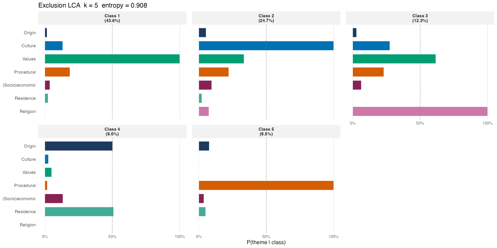{fig-alt="Exclusion LCA classes" width="100%"}

</div>
:::

::: notes

The boundary that looks open from inside has a religiously defined edge visible only from outside.
Religion P=1.00 in this class, near zero everywhere else.
And it isn't *purely* religious: rejection of Islam (P = 1.00) arrives **bundled with the language of values** (P = 0.62).


54% use the same logic to say who belongs and
who does not, and they cluster on the diagonal of the table.8 The largest single group, 26% of those
who answered both, are values-based on both sides, describing belonging and exclusion alike in open,
principled terms. 

By diagonal cell over the total sample: values→values 26.0% (n = 767), culture→culture 17.6% (n = 520),
nativism→nativism 5.6% (n = 166), formalistic→formalistic 5.0% (n = 149). The remaining 45.8% (n = 1,352) switch
class between the two questions
:::

## Where does value-based go? {background-color="#fbfaf7"}

::: {style="text-align:center;"}
<div>

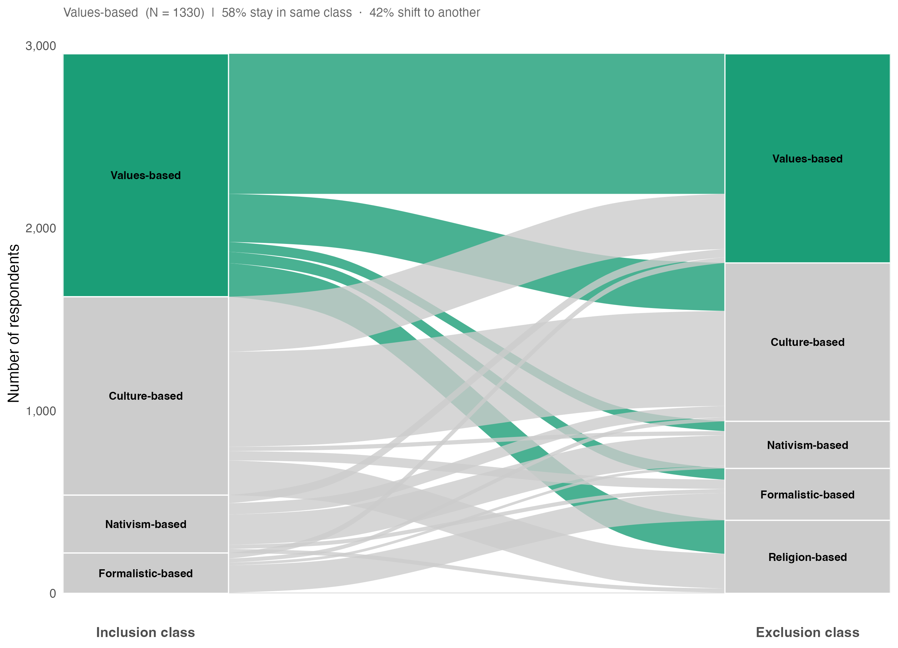{fig-alt="" width="67%"}

</div>
:::

## Where does culture-based go? {background-color="#fbfaf7"}

::: {style="text-align:center;"}
<div>

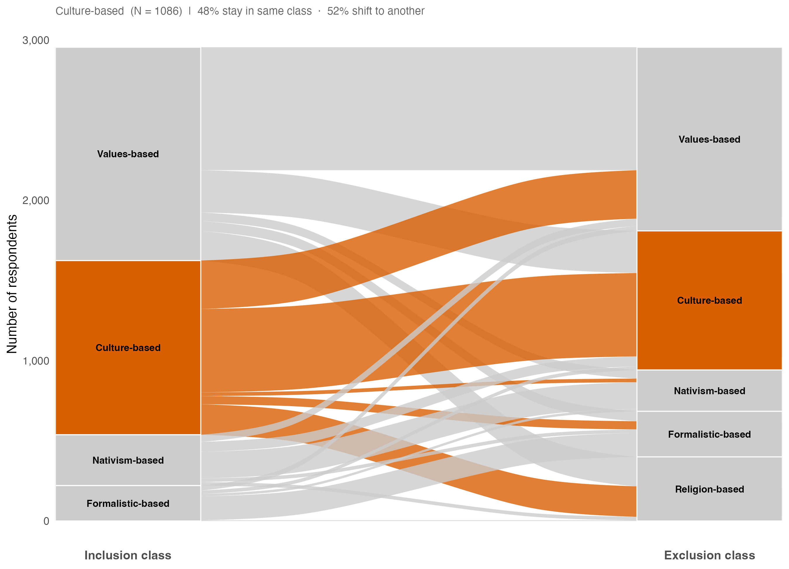{fig-alt="" width="67%"}

</div>
:::

## Where does nativism-based go? {background-color="#fbfaf7"}

::: {style="text-align:center;"}
<div>

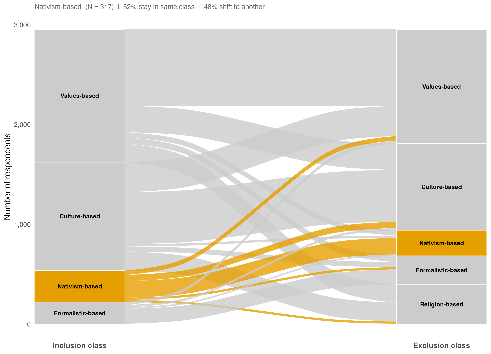{fig-alt="" width="67%"}

</div>
:::

## Where does formalistic-based go? {background-color="#fbfaf7"}

::: {style="text-align:center;"}
<div>

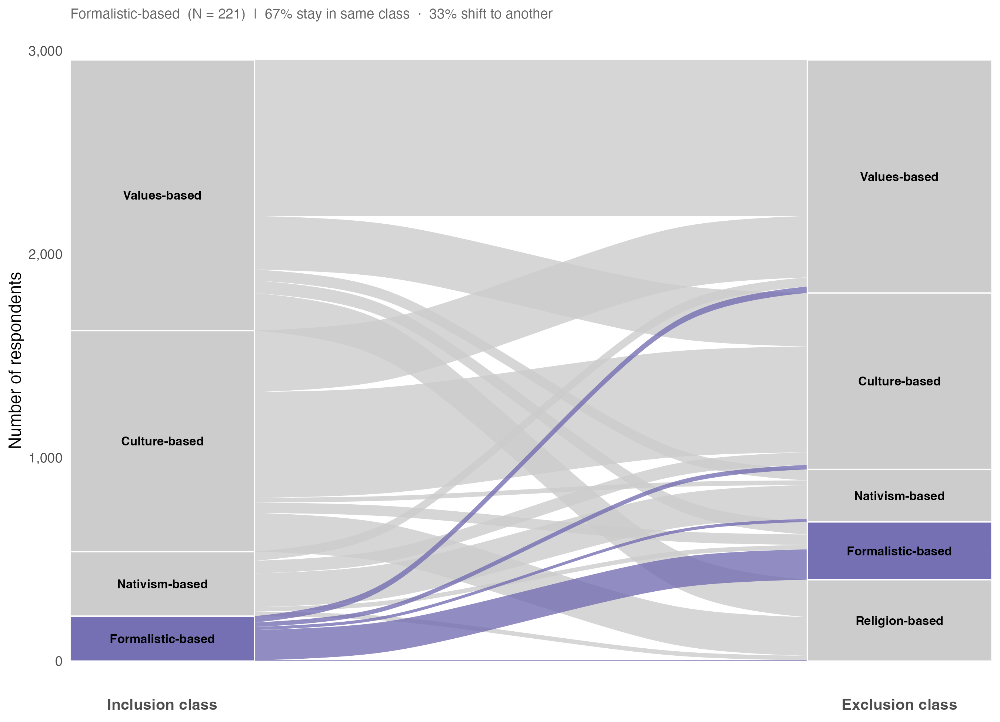{fig-alt="" width="67%"}

</div>
:::

## Who stays, who shifts? {background-color="#fbfaf7"}

::: {style="text-align:center;"}
<div>

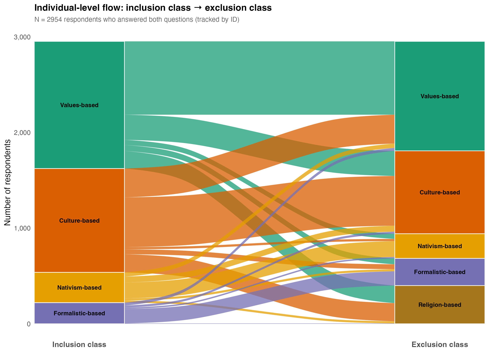{fig-alt="" width="67%"}

</div>
:::

::: notes
The punchline of RQ1.
These people's account of who belongs is as open as anyone's, yet they draw the line at Islam.
Civic vocabulary of belonging + religious exclusion [@SimonsenKristina2020; @alba_foner_2015].

:::

## RQ2 --- Conceptions & political attitudes {background-color="#fbfaf7"}

::: {style="text-align:center;"}
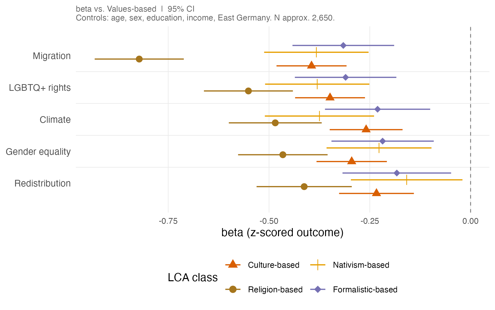{fig-alt="Attitudes by class" width="65%"}
:::

::: {.fragment .muted style="font-size: 0.62em;"}
R²: **Migration** (0.16) · **LGBTQ+ rights** (0.16) · **Gender equality** (0.15) · **Climate** (0.11)<br>
**Redistribution** (0.04)

:::

::: notes
Every exclusionary class is less liberal than values-based --- the **religion-based class most of all**: Tracks the **cultural** dimension (R² ≈ 15--16%), not the economic one (4%).
:::

::: notes
The class that describes belonging in the language of values holds the LEAST liberal attitudes --- sharpest where the anti-Muslim boundary is active.
Robust to religiosity and national pride controls.
:::

## EP vote prediction {background-color="#fbfaf7"}

::: {style="text-align:center;"}
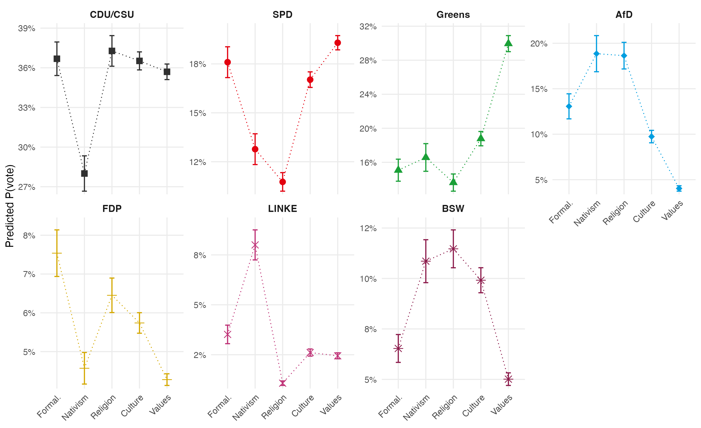{fig-alt="Predicted vote by class" width="65%"}
:::

::: {.fragment .muted style="font-size: 0.62em;"}
R²: **AfD** (0.15) · **Greens** (0.10) · **BSW** (0.10) · **Left** (0.09)
**FDP** (0.05) · **CDU/CSU** (0.02) · **SPD** (0.02)

:::

::: notes
Both facts true, and that's the point.
Strongest relative pull to the radical right; modal destination is mainstream conservative.
Three parties show significant differences across conceptions: **Greens**, **AfD**, **BSW**. The centre (CDU/CSU, SPD) is undifferentiated — all conceptions land there equally.

- <span class="civic">**Greens**</span>: the values-based class is significantly more likely to vote Green; every exclusionary conception significantly less so
- <span class="excl">**AfD**</span>: every exclusionary class pulls toward AfD — religion-based most of all (+1.62 log-odds, ~5&times; odds)
- **Absolute destination**: the religion-based class's plurality vote is still **CDU/CSU** — a clean null on that contrast
:::

## Conclusions {background-color="#fbfaf7"}

::: {.small}
::: {.fragment}
**1. Boundaries are constructed on both sides.** A group is defined not only by what its members share but by where the line is drawn to keep others out.
:::
::: {.fragment}
**2. Values are mentioned by almost everyone, but not in the same way.** </br>
Civic vocabulary of belonging + religious exclusion [@SimonsenKristina2020; @alba_foner_2015].
Selective liberalism [@lopezortega_selectively_2025]
:::
::: {.fragment}
**3. Conceptions show up in political attitudes.** The values-based class is the most progressive on migration, LGBTQ+ rights, and gender equality. The religion-based class is the most restrictive.</br>
Better at predicting cultural attitudes than economic.
:::
::: {.fragment}
**4. And in the ballot box, but only at the poles.** Conceptions of Europeanness predict vote for **Greens** (values-based), **AfD** (religion- and nativism-based), and **BSW** (culture- and religion-based). The centre — CDU/CSU, SPD — is undifferentiated. 
:::
:::

::: notes
1. That openness is **conditional**. A **civic vocabulary does not guarantee an inclusive boundary**.
2. Half of respondents invoke values, some alone, some paired with cultural conditions, some in inclusion but then excluding on religion. Reading only *what* is mentioned overstates the cosmopolitan group. The genuinely open boundary — values-based on both sides — is **26% of respondents**, not the majority.
3. Some respondents describe belonging in open, principled terms and then exclude based on the rejection of Islam. Civic language for inclusion, a bright religious boundary for exclusion — **selective liberalism** in their own words.

Most Germans describe Europeanness in terms [anyone could meet]{style="color:#7fb0d6;"}.
The same words, read against <span style="color:#e8907a;">who is excluded</span>, reveal a line permeable for some and firmly drawn for others.

:::

## Thank you! {background-color="#fbfaf7"}

::: {.contact style="margin-top:.8em; line-height:2.0;"}
**Contact information:**

✉  [i.zeberioaguerrevere\@uva.nl](mailto:i.zeberioaguerrevere@uva.nl)

🌐  [isazeberio.github.io](https://isazeberio.github.io/)

💼  [linkedin.com/in/isabela-zeberio-aguerrevere](https://www.linkedin.com/in/isabela-zeberio-aguerrevere-b46460227/)
:::

## References {.smaller .scrollable visibility="uncounted"}

::: {#refs}
:::

## Europeanness categories {.smaller .scrollable background-color="#fbfaf7" visibility="uncounted"}

| Theme           | Category              | \% incl. | Example (inclusion)               | \% excl. | Example (exclusion)            |
|------------|------------|-----------:|------------|-----------:|------------|
| Origin          | Birthplace            |      8.1 | "Born in Europe"                  |      6.5 | "Not born in Europe"           |
|                 | Ancestry              |      3.0 | "Parents are from Europe"         |      3.6 | "No European roots"            |
|                 | Physical appearance   |      0.4 | "Light skin colour"               |      0.4 | "Being Black"                  |
| Values          | **Values**            | **46.9** | "Respect for individual dignity"  | **39.7** | "Rejects European values"      |
|                 | **Democratic attachment** |   **27.3** | "Defending democracy"     |     **18.7** | "Rejects / fights democracy"   |
|                 | **European feeling**      |     **17.7** | "A 'we-feeling' beyond borders"   |     **16.3** | "Doesn't identify with Europe" |
|                 | (Euro)nationalism     |      3.6 | "Love of one's own country"       |      1.4 | "Not thinking nationally"      |
| Culture         | **Traits & behaviour**    |     **21.9** | "Reliable and punctual"           |     **18.7** | "Intolerant, selfish, violent" |
|                 | Culture               |     10.8 | "The European way of life"        |      9.1 | "Not part of European culture" |
|                 | Language              |      5.5 | "Speaks a European language"      |      3.1 | "Speaks no European language"  |
|                 | Integration           |      5.0 | "Integrate, don't impose beliefs" |      6.0 | "Doesn't want to integrate"    |
|                 | European knowledge    |      3.6 | "Well-informed about the EU"      |      1.0 | "No knowledge of the EU"       |
|                 | History               |      1.8 | "A shared past"                   |      0.6 | "No historical awareness"      |
| Procedural      | **Rights & obligations**  |     **19.0** | "Adhering to law and order"|     **19.2** | "Doesn't abide by laws"        |
|                 | Legal citizenship     |      8.6 | "Citizenship of an EU country"    |      7.0 | "No European passport"         |
| (Socio)economic | Personal contribution |      3.9 | "Not living off the state"        |      5.0 | "Only benefits from welfare"   |
|                 | Economic security     |      3.7 | "Free trade and movement"         |      1.2 | "Wants to close inner borders" |
| Residence       | Place of residence    |     10.8 | "Lives and works in Europe"       |      6.7 | "Lives outside Europe"         |
| Religion        | **Religion**          |      4.9 | "Being Christian; no headscarf"   | **13.8** | "Being Muslim; veiled women"   |
| Meaningless     | EU identity rejection |      2.8 | "There is no European identity"   |      2.1 | "No such thing as it"          |

::: tiny
\% = share of respondents mentioning the code on each side (multi-label; columns do not sum to 100).
Religion: 4.9% → 13.8% is the asymmetry in one number.
:::

## Inclusion × Exclusion class consistency {.smaller background-color="#fbfaf7" visibility="uncounted"}

::: {style="text-align:center;"}

| *Inclusion class* | Values | Culture | Formalistic | Nativism | Religion |
|:------------------|-------:|--------:|------------:|---------:|---------:|
| Values-based      | **57.7** | 19.8 | 4.7 | 4.1 | 13.8 |
| Culture-based     | 27.8 | **47.9** | 4.7 | 2.1 | 17.5 |
| Formalistic-based | 14.0 | 10.0 | **67.4** | 6.8 | 1.8 |
| Nativism-based    | 14.2 | 19.6 | 6.9 | **52.4** | 6.9 |

:::

::: {.muted style="font-size: 0.72em; margin-top: 0.8em;"}
Row percentages; diagonal (bold) = consistent class across both questions.</br>
54% of respondents use the same logic for inclusion and exclusion.<br>
:::


## Examples {.smaller background-color="#fbfaf7" visibility="uncounted"}

How a single criterion shifts meaning by what it sits beside:

-   **Mirror.** *Belongs:* "A basic democratic disposition." </br>
*Excluded:* "Whoever rejects democracy." → same criterion, both ways.
-   **Shift.** *Belongs:* "Western-democratic values, openness to other cultures."</br>
*Excluded:* "Not living in Europe." → values → residence.
-   **Values → religion.** *Belongs:* "Tolerance, love of freedom, values!" </br>
*Excluded:* "Belonging to Islam; clan-formation; national thinking, e.g. among Turks."</br>
-  *Belongs:* "Christian values; speaks a European language; free, equal rights, democratic."</br> *Excluded:* "Burqa, veiling; rejects democratic values or equal rights."
-   *Belongs:* "Open worldview, democratic, secularist."</br>
*Excluded:* "Those who pursue an Islamisation of Europe... undermining the Judeo-Christian culture that constitutes Europe."

::: tiny
Gender equality and sexual-minority rights recast as European achievements, set against an Islam framed as illiberal [@brubaker_2017].
:::

## LCA model selection {.smaller background-color="#fbfaf7" visibility="uncounted"}

::: {style="font-size: 0.78em;"}
**Inclusion** (selected: k = 4)

| k | AIC | BIC | ΔBIC | Entropy | Min. class |
|--:|----:|----:|-----:|--------:|-----------:|
| 2 | 19,266 | 19,358 | --- | 0.637 | 41.1% |
| 3 | 19,019 | 19,159 | −199 | 0.819 | 25.2% |
| **4** | **18,799** | **18,988** | **−171** | **0.886** | **7.6%** |
| 5 | 18,724 | 18,962 | −26 | 0.765 | 6.2% |
| 6 | 18,617 | 18,904 | −59 | 0.870 | 4.0% |

**Exclusion** (selected: k = 5)

| k | AIC | BIC | ΔBIC | Entropy | Min. class |
|--:|----:|----:|-----:|--------:|-----------:|
| 2 | 18,244 | 18,335 | --- | 0.813 | 44.0% |
| 3 | 17,958 | 18,097 | −238 | 0.854 | 23.5% |
| 4 | 17,710 | 17,897 | −200 | 0.896 | 10.5% |
| **5** | **17,521** | **17,756** | **−141** | **0.908** | **9.5%** |
| 6 | 17,412 | 17,696 | −61 | 0.894 | 4.9% |
:::

::: {.muted style="font-size: 0.65em; margin-top: 0.5em;"}
Selection on joint basis of fit (BIC elbow), entropy, and interpretability.
k = 5 for exclusion: BIC elbow + entropy peak + religion class emerges as qualitatively new profile (P = 1.00).
At k = 4 religion loads weakly across all classes (range 0.13–0.23) — no organizing class.
:::

## Political attitudes by exclusion class {.smaller background-color="#fbfaf7" visibility="uncounted"}

| Outcome | Culture | Religion | Nativism | Formalistic | $N$ | $R^2$ |
|:--------|--------:|---------:|---------:|------------:|----:|------:|
| Migration | −0.40*** (0.04) | −0.82*** (0.06) | −0.38*** (0.07) | −0.32*** (0.06) | 2,646 | 0.16 |
| LGBTQ+ rights | −0.35*** (0.04) | −0.55*** (0.06) | −0.38*** (0.07) | −0.31*** (0.06) | 2,648 | 0.16 |
| Gender equality | −0.30*** (0.04) | −0.47*** (0.06) | −0.23*** (0.07) | −0.22*** (0.07) | 2,646 | 0.15 |
| Climate | −0.26*** (0.05) | −0.49*** (0.06) | −0.38*** (0.07) | −0.23*** (0.07) | 2,574 | 0.11 |
| Redistribution | −0.23*** (0.05) | −0.41*** (0.06) | −0.16* (0.07) | −0.18** (0.07) | 2,647 | 0.04 |

::: {.muted style="font-size: 0.65em; margin-top: 0.6em;"}
β (SE), OLS, z-scored composites. Reference: values-based. Controls: age, sex, education, income, East Germany.<br>
\* p<.05 · \*\* p<.01 · \*\*\* p<.001
:::

## EP vote by exclusion class {.smaller background-color="#fbfaf7" visibility="uncounted"}

| Class | CDU/CSU | SPD | Greens | AfD | FDP | Left | BSW |
|:------|--------:|----:|-------:|----:|----:|-----:|----:|
| Culture | 0.04 (0.12) | −0.12 (0.15) | −0.55*** (0.14) | 0.86*** (0.23) | 0.42 (0.25) | −0.03 (0.35) | 0.66** (0.22) |
| Religion | 0.10 (0.15) | −0.54** (0.21) | −0.91*** (0.20) | 1.62*** (0.24) | 0.56 (0.30) | −1.02 (0.63) | 0.76** (0.26) |
| Nativism | −0.21 (0.19) | −0.27 (0.25) | −0.76*** (0.23) | 1.44*** (0.28) | 0.21 (0.41) | 0.92* (0.37) | 0.54 (0.30) |
| Formalistic | 0.06 (0.17) | −0.07 (0.21) | −0.68** (0.22) | 1.08*** (0.29) | 0.79* (0.33) | 0.18 (0.46) | 0.03 (0.34) |
| R² | 0.02 | 0.02 | 0.10 | 0.15 | 0.05 | 0.09 | 0.10 |

::: {.muted style="font-size: 0.65em; margin-top: 0.6em;"}
Log-odds (SE). Separate binary logits, reference: values-based. Controls: age, sex, education, income, East Germany. EP 2024 vote.<br>
\* p<.05 · \*\* p<.01 · \*\*\* p<.001
::: 

## Robustness: religiosity and national pride {.smaller background-color="#fbfaf7" visibility="uncounted"}

| Outcome | Religion (M2) | + Religiosity | + National pride |
|:--------|--------------------:|--------------:|-----------------:|
| Migration | −0.82*** | −0.85*** | −0.82*** |
| LGBTQ+ rights | −0.55*** | −0.60*** | −0.54*** |
| Gender equality | −0.47*** | −0.51*** | −0.49*** |
| Climate | −0.49*** | −0.51*** | −0.50*** |
| Redistribution | −0.41*** | −0.42*** | −0.38*** |

::: {.muted style="font-size: 0.65em; margin-top: 0.6em;"}
β, OLS, z-scored composites. Religion-based class vs. values-based reference.
Adding personal religiosity and German national pride leaves the religion-based class undiminished —
the class reflects boundary-drawing logic, not personal piety or national attachment.
:::

## Political attitudes by inclusion class {.smaller background-color="#fbfaf7" visibility="uncounted"}

| Outcome | Culture | Nativism | Formalistic | $N$ | $R^2$ |
|:--------|--------:|---------:|------------:|----:|------:|
| Migration | −0.16*** (0.04) | −0.18** (0.06) | −0.15* (0.07) | 2,814 | 0.09 |
| LGBTQ+ rights | −0.15*** (0.04) | −0.22*** (0.06) | −0.14* (0.07) | 2,813 | 0.14 |
| Gender equality | −0.16*** (0.04) | −0.19** (0.06) | −0.06 (0.07) | 2,814 | 0.13 |
| Climate | −0.09* (0.04) | −0.24*** (0.06) | −0.18* (0.07) | 2,736 | 0.09 |
| Redistribution | −0.14*** (0.04) | −0.10 (0.06) | −0.18* (0.07) | 2,812 | 0.03 |

::: {.muted style="font-size: 0.65em; margin-top: 0.6em;"}
β (SE), OLS, z-scored composites. Reference: values-based. Controls: age, sex, education, income, East Germany.
No religion class on the inclusion side — pattern holds but contrasts are smaller, as expected.
:::

## Why not automated coding? {.smaller background-color="#fbfaf7" visibility="uncounted"}

Three approaches tried and rejected:

- **Dictionary methods** — systematic false positives: "skin colour" flagged even when respondents *denied* it mattered; only contextual reading distinguishes use from denial
- **BERTopic** — useful exploratory tool (recovered clusters: institutional, biographical, democratic values, socioeconomic, cultural traits), but assigns *one* topic per response — misses the multi-criteria structure of most answers
- **Zero-shot / few-shot multi-label models** — failed to recover ideas visible on reading; fine-tuning would have required the manual annotation already being done

::: {.muted style="font-size: 0.65em; margin-top: 0.6em;"}
Cohen's κ > 0.80 on all 20 categories (two trained native German-speaking coders, 15% double-coded).
:::
